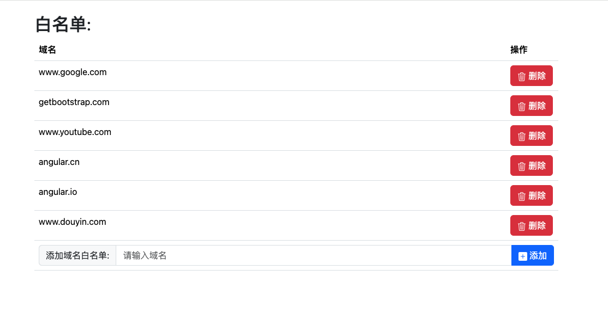

# 网站视频快捷键

## 快捷键说明
| 快捷键      | 功能 |
| ----------- | ----------- |
| 右方向键(→)|快进5秒
| Alt + 右方向键(→)|快进10秒
| 左方向键(←)|后退5秒
| Alt + 左方向键(←)|快进10秒
| 空格键(space)|播放/暂停
| 向上箭头(↑)|增加音量10%
| 向下箭头(↓)|减小音量10%

## 白名单设置
1. 不想使用快捷键的网站，可以在白名单中添加。在popup页面中点击"添加白名单"按钮，即可添加。 不过要重新刷新下载加载才能生效。
popup页面截图：

2. 本插件还提供了编辑白名单的功能，可以在popup页面中点击"编辑白名单列表"按钮，即可打开白名单编辑页面。
options页面截图：
